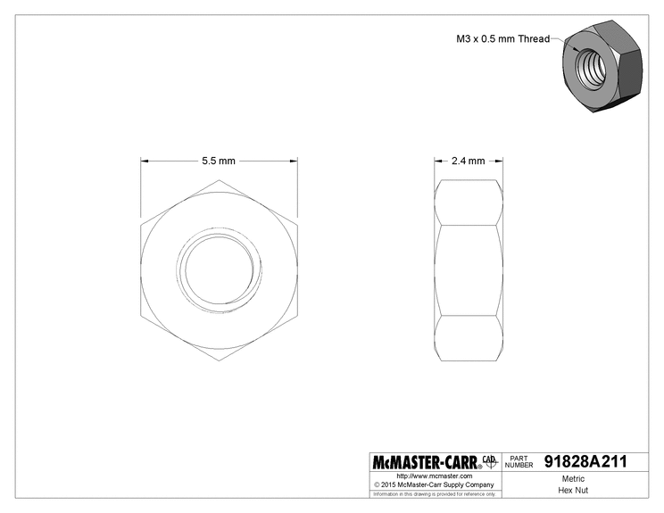

# BOM Buyer's Guide

**Note:** If you purchased a full kit, you can ignore this entire document as it's been taken care of for you.

We have tried to keep the Bill of Materials (BOM) as simple as possible with as few sources as possible. However, there are a number of things to keep in mind if you are sourcing all of your own components. **Before** ordering your components, please be sure to read this guide in full.

## Misumi vs McMaster-Carr

If you are just building a single Engravinator, buying all of the hardware components from Misumi is by far the least expensive option. The per unit cost of the nuts and bolts is more than at McMaster, however the *total* cost will be less as McMaster requires you to buy all bolts in minimum quantities (usually 50 or 100). Since some of the components *must* come from Misumi it's easier and cheaper to just buy everything from Misumi.

The one exception to this is the M3 nuts which will be discussed next.

If you, however, have a reason to purchase some of the components from McMaster, use the part numbers provided below and be careful to check you purchase enough, based on how many Engravinators you are building.

| Component       | Part Number                                     |
|-----------------|-------------------------------------------------|
| M2 x 8mm Screw  | [91290A015](https://www.mcmaster.com/91290A015) |
| M3 x 5mm Screw  | [91290A110](https://www.mcmaster.com/91290A110) |
| M3 x 10mm Screw | [91290A115](https://www.mcmaster.com/91290A115) |
| M3 x 15mm Screw | [91290A572](https://www.mcmaster.com/91290A572) |
| M3 x 20mm Screw | [91290A123](https://www.mcmaster.com/91290A123) |
| M3 x 25mm Screw | [91290A125](https://www.mcmaster.com/91290A125) |
| M3 x 30mm Screw | [91290A130](https://www.mcmaster.com/91290A130) |
| M3 Nut          | [91828A211](https://www.mcmaster.com/91828A211) |

## M3 Nuts

For some reason, Misumi seems to really not want to sell M3 nuts. They will sell them to you, of course, but the cheapest we've found, the [SLBNR3](https://us.misumi-ec.com/vona2/detail/110300250540/?HissuCode=SLBNR3), are 34 cents each!

For this reason we recommend getting them elsewhere. One option is McMaster as listed in the above section. You'll get a box of 100, which is more than enough and, if that's all you get, it'll be about $11 shipped.

But you can also likely find them somewhere else like Amazon, eBay, or Aliexpress. Or if you are lucky enough to live in the non-imperial units rest of the world... your local hardware store.

**Just be sure that what you get is M3 with a 0.5mm thread pitch, 2.4mm thick, and 5.5mm flat-to-flat as shown below.**

## Belts & Pulleys

In small quantities we've never found a specific supplier from which to purchase belts and pulleys. We recommend Amazon, eBay, or Aliexpress. Just be absolutely sure that what you purchase matches the listed dimensions. We have designed the Engravinator to accommodate small variations in overall pulley size, however you should fine pulleys as close as possible to:

-   Drive: GT2-16 tooth, 5mm bore, 13mm OD, 6mm belt width
-   Idler: GT2-16 tooth, 3mm bore, 13mm OD, 6mm belt width

For the belts, you need two 600mm sections of GT2-6mm belt. Note that some places may list it as 2GT which is the same thing. It *must* be 6mm wide though!
Also be sure to get standard fiber reinforced belts. **Do not** use steel reinforced belts! The pulley radius is too small and they could break.

## Laser Module

The Engravinator was designed to fit the commonly found Chinese PWM laser modules that use a 16x40mm M3 mounting pattern. Please note that you **must** use a PWM laser, not TTL! Those are two different things. We recommend looking for a module that includes the driver board on the module itself as there's not accommodations for mounting an external driver board.

We've had exceptional experience with the modules from EleksMaker, especially the [EL01](http://store.eleksmaker.com/index.php?route=product/product&path=101&product_id=163) which can be had in 0.5W and 2.5W versions.

Otherwise, we recommend looking on Amazon, eBay, or Aliexpress.

## Power Supply

This is dependent on the controller you are using but we will assume you are using the [Maniacal Labs Platypus](https://maniacallabs.com/platypus) or similar. In which case, you will require a 12V switching AC/DC adapter with at least 6A output and a 2.1mm, center-positive, barrel connector.

Something like this from DigiKey would work well: [GST90A12-P1M](https://www.digikey.com/product-detail/en/mean-well-usa-inc/GST90A12-P1M/1866-2154-ND/7703717)

However, we get that's expensive and you can likely find something cheaper on Amazon or eBay such as this one: <https://www.amazon.com/gp/product/B00LWQ2GS0/>

Just make sure it meets the specs listed above.

## Controller & Stepper Drivers

The [Maniacal Labs Platypus](https://maniacallabs.com/platypus) controller was designed specifically with the Engravinator in mind and all guides assume you will be using this controller. However, any 2+ axis controller with laser support should work fine. So if you have a preferred controller we won't be insulted

For stepper drivers, if your controller of course does not have them built in, we highly recommend the TMC2208 SilentStepStick, as listed in the BOM. Any StepStick / Pololu style driver that supports at least 1/16 microstepping should work though.

## Wiring

You will, at least, need hookup wire for the limit switches. We recommend using 20-24 gauge stranded wire and, if possible, wire that comes with and outer sheath, containing both wires. We recommend either speaker wire or "alarm" wire.

Most likely the laser module you purchase will include an appropriate cable and you can use that. If it does not, we recommend the same type of wire mentioned above, but 20 gauge with 3-4 conductors instead of 2.

We also recommend ~2mm heat shrink tubing for properly insulating the limit switch connections.

## Aluminum Extrusions

You might be tempted to just buy a long length of 2020 extrusion and cut your own pieces. **Resist this temptation!!**

The Engravinator is designed with tight tolerances and the aluminum extrusion creates the foundation of the entire machine. Which must be perfectly square and of exact size. All the extrusions from Misumi, cut to within 0.5mm of the required length, are only $36 for the set and well worth the cost.

## Miscellaneous

While the zip ties are absolutely required, the rest of the items listed here are merely recommended. Everything below can easily be found online or in your local hardware store.

-   **Zip Ties:** Strain relief is handled in many places via the use of small zip ties. The size you need have roughly a 2.5mm x 1mm cross section and be at least 100mm long. This is typically the smallest size you will see for sale.
-   **Silicone/Rubber Feet:** These depend on how you will be using your Engravinator but we recommend 25mm x 25mm square, self-stick, silicone rubber feet. It will help keep the machine in place while engraving.
-   **Heat shrink tubing:** When soldering the wires to each of the limit switches, we highly recommend using short lengths of 3mm diameter heat shrink tubing to insulate the solder joints. Plus it just looks nicer :)

## Enclosure Acrylic

If you do not have access to a laser cutter and need someone else to cut the acrylic for you, please checkout the [Fabrication Guide](/mk1/print/#enclosure-laser-cut-parts).

__*DISCLAIMER*__: *Our research has shown that the suggested acrylic below will block any and all dangerous light coming from the laser, making it safe to use without special glasses. However, without acquiring laboratory tested (and much more expensive) acrylic that is specifically validated for this use we cannot guarantee your complete eye safety. Maniacal Labs assumes no responsibility for any damage or injury caused by use of these designs.*

If you have your own laser cutter (with at least a 400mm x 300mm working area) and want to cut your own enclosure panels, you'll need the right acrylic. It must be 3mm (1/8") thick, semi-transparent, and ideally orange, red, or green.

We highly recommend using #2422 orange such as [this from EStreet Plastics](https://www.estreetplastics.com/1-8-inch-transparent-orange-2422-plexiglass-sheets-s/137.htm)